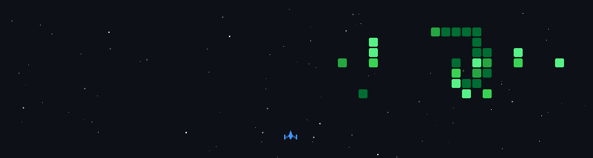

 
  

  <h1 align="left">Let's Connect and have a Chat! 📬</h1>
  
  

    

      
      
      
    

  

  
   
  
 <!--
 <h1 align="left">Tech Stack 💻</h1>
  

     
    
  

   
  -->
  
  <h1 align="left">My GitHub Contribution 🐍</h1>

  
   
  
  <h1 align="left">Github Stats 📊</h1>
  
  
  
  
  
  
  
   
  
  

  
  <h1 align="left">Random Dev Quote ✍</h1>
  
 

